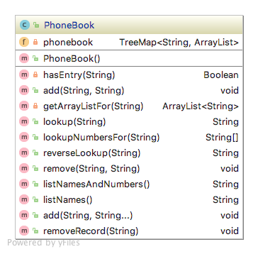

# Holding Objects Lab:

* Fork and clone this repository to complete your lab. Submit each part with a Pull Request for a separate branch.

## Unit Tests

* You are expected to write unit tests for your code.
* Be sure to write the tests before implementing the functionality being tested.
* Tests must be thorough and address all possible paths through each method.

## Submission

* Your completed lab must be submitted via GitHub.
* Labs are not complete unless they include UML diagrams of all implemented classes, as well as unit tests for all features.

## Instructions:

### Building a basic `PhoneBook` class



* Create a `PhoneBook` class that holds names and phone numbers.
* You can use an [associative data type](https://en.wikipedia.org/wiki/Associative_array) (one which stores items as keys paired with values).
* **Hint:** You should use a sorted map.


* Your PhoneBook class should have the following method

	* `add(String name, String phoneNumber)`
		* adds an entry to the composite associate data type
	* `remove(String name)`
		* removes an entry to the composite associate data type
	* `lookup(String name)`
		* returns a phone number for the respective input `name`

	* `reverseLookup(String phoneNumber)`
		* returns a name for the respective input `phoneNumber`
	* `listNamesAndNumbers()`
		* Create a String that has all the entries (names and phone numbers) in alphabetical order.

	   * Sample Script
	
		   ```java
		   PhoneBook phoneBook = new PhoneBook();
		   phoneBook.add("Zebra", "111-222-333");
		   phoneBook.add("Dog", "222-444-4444");
		   phoneBook.listNamesAndNumbers(); 
		   ```
	
	   * Sample Output
	
		   ```
			Dog 222-444-4444
			Zebra 111-222-333
		   ```
      

### Implementing Many-PhoneNumbers-To-One-Person Relationship

* [Some people have more than one](https://en.wikipedia.org/wiki/One-to-many_(data_model)) phone number.
* Refactor your `PhoneBook` class to map names to lists of phone numbers.
* You should modify your `add()` and `remove()` methods to handle adding or removing individual numbers
* Create a `removeRecord` method for removing an entire entry from your PhoneBook.
